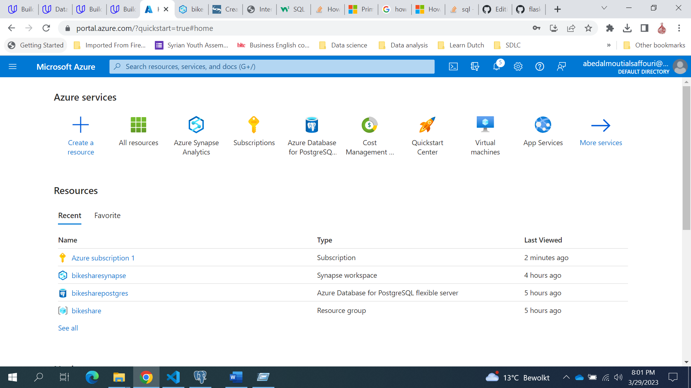

## Project: Building an Azure Data Warehouse for Bike Share Data Analytics
Divvy is a bike sharing program in Chicago, Illinois USA that allows riders to purchase a pass at a kiosk or use a mobile application to unlock a bike at stations around the city and use the bike for a specified amount of time. The bikes can be returned to the same station or to another station. The City of Chicago makes the anonymized bike trip data publicly available for projects like this where we can analyze the data.

## Project goal
The goal of this project is to develop a data warehouse solution using Azure Synapse Analytics. You will:

- Design a star schema based on the business outcomes listed below;
- Import the data into Synapse;
- Transform the data into the star schema;
- and finally, view the reports from Analytics.

#### The business outcomes you are designing for are as follows:

Analyze how much time is spent per ride
- Based on date and time factors such as day of week and time of day
- Based on which station is the starting and / or ending station
- Based on age of the rider at time of the ride
- Based on whether the rider is a member or a casual rider

Analyze how much money is spent
- Per month, quarter, year
- Per member, based on the age of the rider at account start

EXTRA CREDIT - Analyze how much money is spent per member
- Based on how many rides the rider averages per month
- Based on how many minutes the rider spends on a bike per month

## Instructions
The below diagram shows the project architecture.  
- Using Azure Portal to Create Postgres flexible server & Synapse Analysis workspace.
- Using Python to Create udacityproject database & upload csv data. 
- Using Synapse to Ingest data from Postgres OLTP and saving each table to txt file in Data Lake Storage G2.
- Staging each file in Data Lake G2 to External Table in Synapse.
- Create Star Schema in Synapse.
- Transform Data using SQL to SQL to transforme data from staging to star schema
- Applied data analysis.

### Using Azure Portal to Create Postgres flexible server & Synapse Analysis workspace.
using your Azure credential to create postgres flexible server and Synapse Analysis workspace 

### Using Python to Create udacityproject database & upload csv data.
TODO

### Using Synapse to Ingest data from Postgres OLTP and saving each table to txt file in Data Lake Storage G2.
TODO

### Staging each file in Data Lake G2 to External Table in Synapse.
TODO

### Create Star Schema in Synapse.
TODO

### Transform Data using SQL to SQL to transforme data from staging to star schema
TODO

### Applied data analysis
TODO

